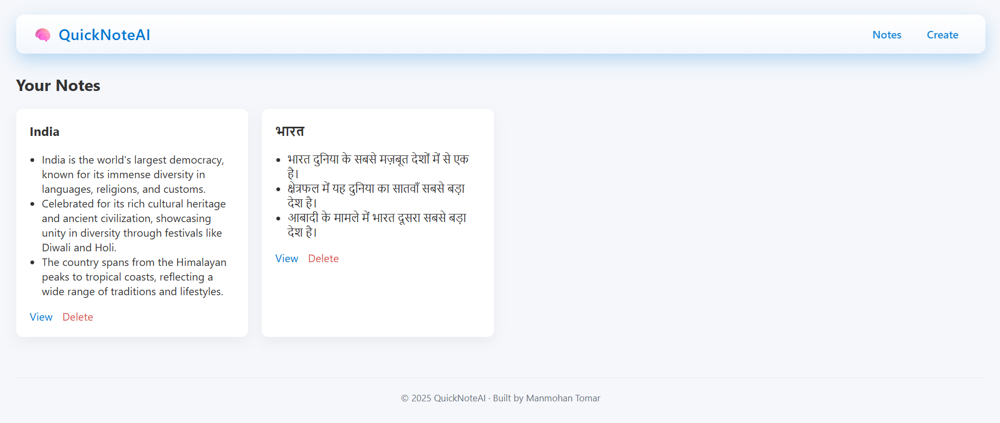
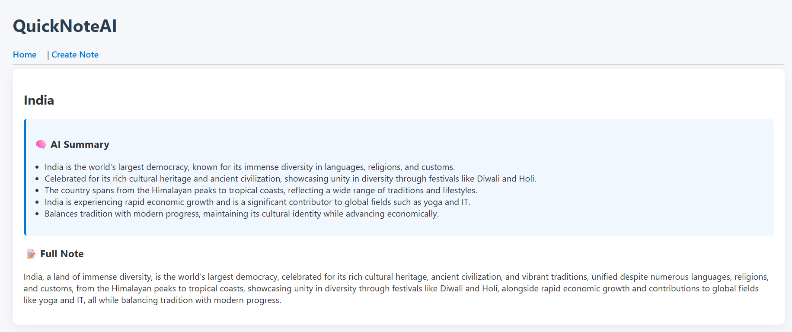
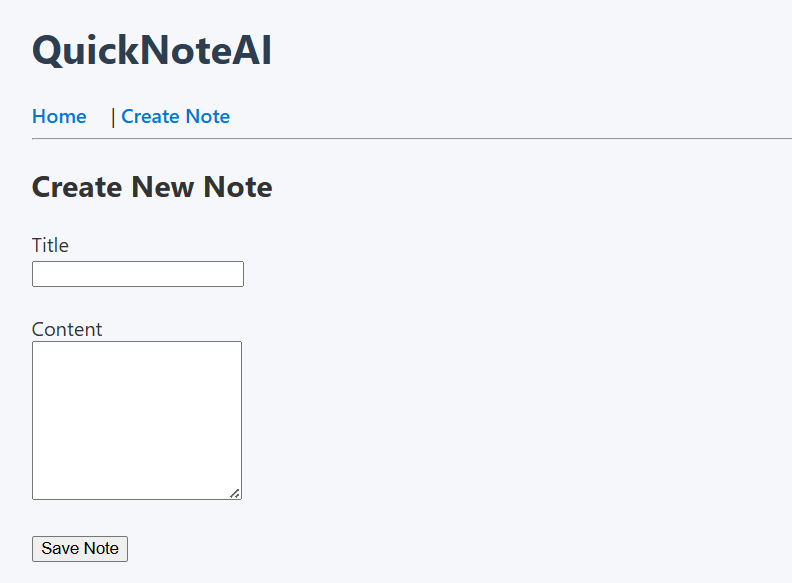

QuickNoteAI - AI-powered notebook using Flask App (MVP)
Features in This Version
-Create notes
-View all notes
-View single note
-Delete notes
-SQLite database
-Clean structure (Azure-ready)

ChatGPT/Copilot are general-purpose AI tools. QuickNoteAI is a context-aware personal knowledge tool.
Example-
1. Student writes: Daily lecture notes and clicks “Weekly Summary”.
   AI generates: Key concepts, Important formulas, Exam-focused highlights

2. Developer stores: Meeting notes
   AI generates: Action items, Follow-ups, Technical summaries

ChatGPT doesn’t remember this for them.

You would need OPENAI_API_KEY to run in your local.

View Project Images at - 
### Home Page

### View Page

### Create Note Page

